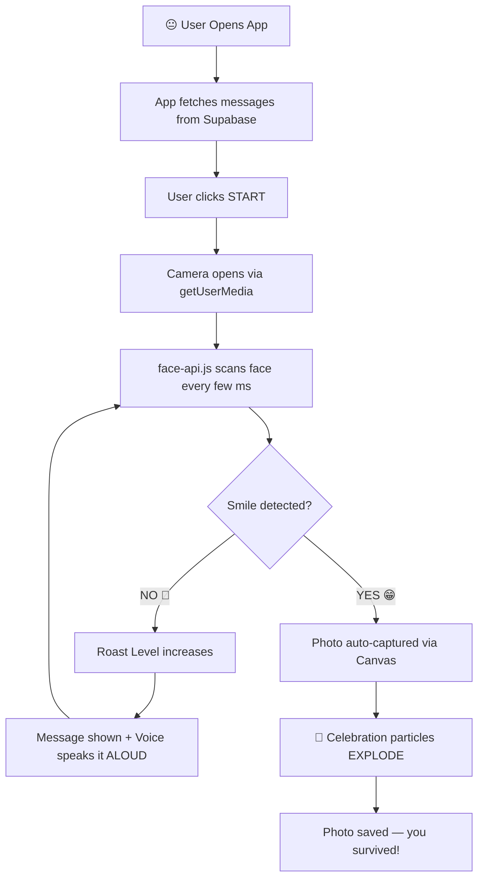

<!-- ANIMATED HEADER -->
<div align="center">


<!-- TYPING ANIMATION -->
<a href="https://git.io/typing-svg">
  
</a>

<br/>

<!-- BADGES -->


<br/>


</div>

---

## 😤 The Story Behind This

> You know that one friend who holds the camera and keeps saying...
>
> *"Smile!"*  🙂
> *"Come on, SMILE!"*  😐
> *"BRO JUST SMILE PLEASE"*  😑
> *"WHY AREN'T YOU SMILING"*  😤
>
> **Yeah. That was me. Every. Single. Time.**

So I built **SmileShot** — a camera that does the yelling FOR me. 🎉  
No smile? It **roasts you**. Publicly. Out loud. Until you smile.

You're welcome. 😈

---

## 🔥 Roast Escalation System

```
0s  → 😊 "Hey, you look great! Just smile a little..."
5s  → 😏 "Still no smile? Are you okay buddy?"
15s → 😒 "This is getting awkward for everyone..."
30s → 😤 "YOUR FACE IS BROKEN. CALL TECH SUPPORT."
60s → 💀 *unspeakable things are said*
```

> The longer you refuse to smile, the more it **escalates**. There is no escape. Only smiling.

---

## ✨ Features

<table>
<tr>
<td>

### 🎥 Live Camera
Browser's built-in WebRTC API.  
No app download. No install.  
Just open and suffer.

</td>
<td>

### 🤖 AI Face Detection
face-api.js runs **100% in your browser**.  
No data sent to any server.  
Your sad face stays private. 😢

</td>
</tr>
<tr>
<td>

### 🔊 Voice Roasts
Text-to-Speech reads every roast **OUT LOUD**.  
Your friends will hear it.  
You cannot escape.

</td>
<td>

### 📸 Auto Capture
The SECOND you smile →  
**CLICK.** Photo taken.  
No manual button needed.

</td>
</tr>
<tr>
<td>

### 🎉 Celebration Burst
When you finally smile,  
confetti and emojis EXPLODE  
on screen. You earned it.

</td>
<td>

### ⚙️ Admin Panel
Change roast messages anytime.  
Customize colors, timing, threshold.  
Make it even more brutal. 😂

</td>
</tr>
</table>

---

## 🛠️ Tech Stack

```
📦 SmileShot
├── 🎨 Frontend        → React 18 + TypeScript + Vite
├── 💅 Styling         → Tailwind CSS
├── 🤖 AI Detection    → face-api.js (TensorFlow.js)
├── 🗄️ Database        → Supabase (PostgreSQL)
├── 🔊 Voice           → Web Speech API (Text-to-Speech)
├── 📷 Camera          → WebRTC getUserMedia
├── 🖼️ Photo Capture   → HTML Canvas
└── 🎉 Animations      → CSS + Particles
```

---

## ⚙️ How It Works



---

## 🚀 Getting Started

```bash
# Clone the repo
git clone https://github.com/yourusername/SmileShot.git

# Go inside
cd SmileShot

# Install dependencies
npm install

# Add your Supabase keys in .env
VITE_SUPABASE_URL=your_url_here
VITE_SUPABASE_ANON_KEY=your_key_here

# Run it
npm run dev
```

> ⚠️ **Warning:** Running this app near people who can't smile is a liability. We are not responsible for any friendships damaged by Level 4 roasts.

---

## 📁 Project Structure

```
src/
├── components/
│   ├── SmileShot.tsx       ← 🧠 Core logic (the bully)
│   ├── CameraView.tsx      ← 📷 Video + face indicator
│   ├── RoastBox.tsx        ← 💬 Message display
│   ├── SmileMeter.tsx      ← 📊 Real-time smile score bar
│   ├── AdminPanel.tsx      ← ⚙️ Settings (4 tabs)
│   ├── Particles.tsx       ← 🎉 Celebration explosion
│   └── FunnyBackground.tsx ← 🎨 Floating decorative emojis
├── hooks/
│   ├── useCamera.ts        ← 🎥 Webcam management
│   ├── useFaceDetection.ts ← 🤖 face-api.js loop
│   ├── useAudio.ts         ← 🔊 Audio file playback
│   └── useAppData.ts       ← 🗄️ Supabase data fetcher
└── App.tsx                 ← 🏠 Root component
```

---

## 😂 Roast Levels Explained

| Level | Time | Color | Vibe |
|-------|------|-------|------|
| 0 | 0–5s | 🟢 Green | "Hey bestie, tiny smile?" |
| 1 | 5–15s | 🟡 Yellow | "We're all waiting..." |
| 2 | 15–30s | 🟠 Orange | "This is concerning." |
| 3 | 30–60s | 🔴 Red | "ARE YOU EVEN ALIVE" |
| 4 | 60s+ | 🟣 Magenta | *too savage to document* |

---

## 🔒 Privacy First

> **Your face data never leaves your device.**  
> face-api.js runs entirely in the browser using TensorFlow.js.  
> No images uploaded. No face stored. No servers involved.  
> Just you, your face, and the roasting. 🙂

---

## 🏆 Built For

This project was built for a **Hackathon** — born from the very real frustration of taking group photos with friends who simply **refuse to smile.**

The solution? **Make the camera do the peer pressure.**

---

<div align="center">


**Made with 😤 frustration, ☕ caffeine, and a burning desire to make friends smile**

⭐ Star this repo if it made you smile (ironically proving the app works)

</div>
